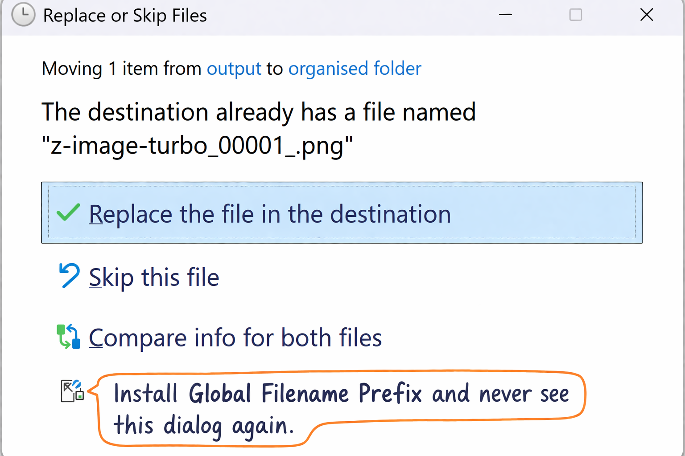

# ComfyUI Global Filename Prefix

Adds a configurable prefix to **all output filenames globally** in ComfyUI. Avoid getting duplicate filenames after organising your output folder!

ComfyUI normally applies filename prefixes per-node. That's very flexible, but creates chaos in your output folder as you switch between different workflows and templates, and the moment you try to organise your output folder you inadvertently reset the filename counter and wind up reusing old filenames causing even more chaos.

This extension solves this:

- Timestamp insertion to permanently solve filename clashes
- Custom prefix templates
- Works with built-in SaveImage nodes
- Works with VideoHelperSuite Video Combine
- Applies automatically across workflows

---

## Example output filename

    2026-03-22 18-14-09 ComfyUI_00001.png

---

## Settings

Located under:

    Settings -> Global Filename Prefix

Options:

| Setting | Description |
|--------|-------------|
Enabled | Toggle prefix injection |
Prefix template | Customizable formatting template |
Timestamp format | Python `strftime()` format string |

Example template:

    {timestamp} {prefix}

Supported variables:

| Variable | Meaning |
|----------|--------|
{timestamp} | Generated timestamp |
{prefix} | Original filename prefix |

---

## Installation

### Via ComfyUI Manager (recommended)

Coming soon.

### Manual install

Clone into:

    ComfyUI/custom_nodes/

Example:

    cd ComfyUI/custom_nodes
    git clone https://github.com/DarkStarSword/comfyui-global-filename-prefix

Restart ComfyUI.

---

## Compatibility

Tested with:

- SaveImage
- SaveAnimatedWEBP
- VHS Video Combine

Should work with any node using ComfyUI filename prefix helpers.

---

## License

[MIT](LICENSE)
